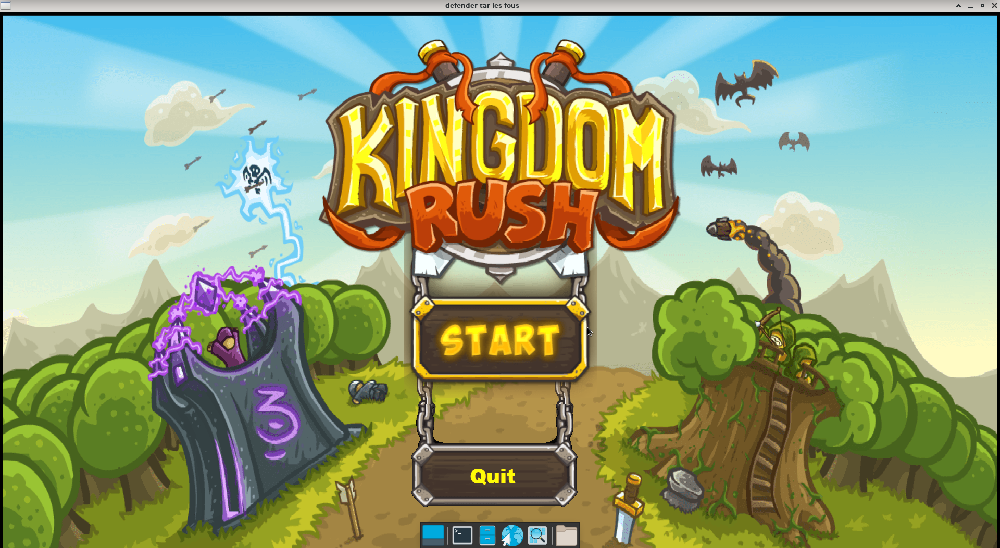
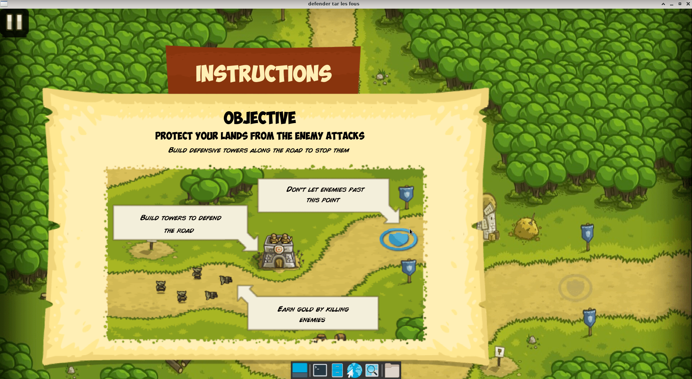
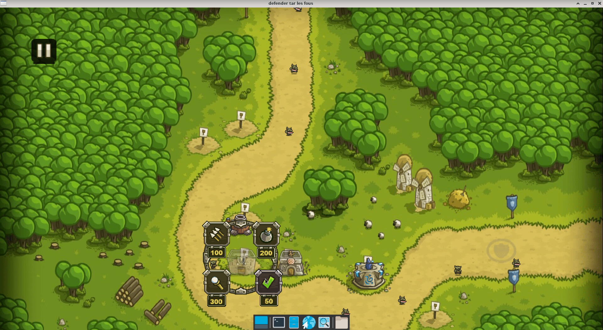
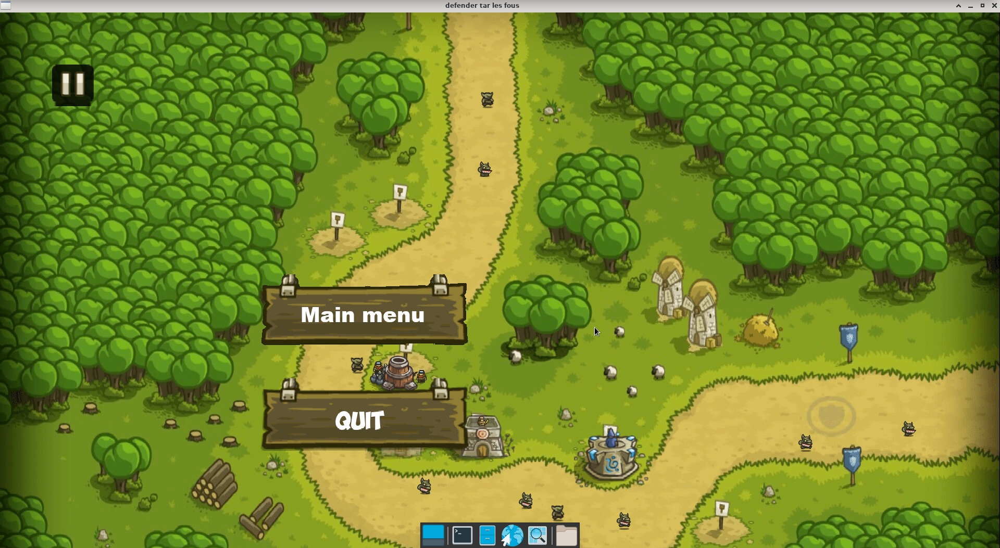

# my_defender

Réalisation d'un Tower-Defense en 2d à l'aide de la CSFML en groupe de 3 personnes.

Pour ce projet nous avons choisis de recréer un tower defense très connu, Kingdom Rush.  
Nous avons choisis de créer un moteur de jeu basé sur l'utilisation et la lecture de fichier JSON.  
Après plusieurs jours de brainstorming nous avons commencé à développer la structure de ce dernier en nous inspirant de Unity.  
En effet nous avons mis en place un système d'addons/scènes stockés grace aux fichier JSON ce qui nous a permis de rajouter facilement du contenu au jeu.  

Après plusieurs semaines de développement de ce dernier, voilà le résultat que nous avons obtenus.  

Menu Principal:

Ecran explicatif:

Ecran de jeu:

Ecran de pause:

